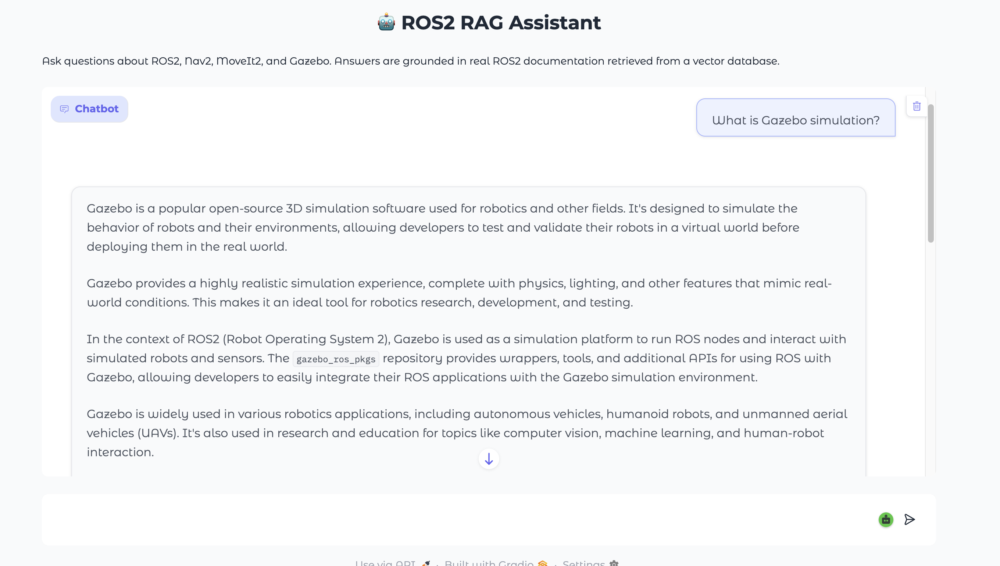

# 🤖 ROS2 RAG Assistant

A domain-specific RAG (Retrieval Augmented Generation) system 
for ROS2 robotics documentation. Ask questions about Nav2, 
MoveIt2, Gazebo, and SLAM — get answers grounded in real documentation.

## 🏗️ Architecture

ETL Pipeline → MongoDB → Feature Engineering → Qdrant
↓
User Query → Embedding → Vector Search → Groq LLM → Answer

## 📊 RAGAS Evaluation Results

| Metric | Score |
|--------|-------|
| Faithfulness | 0.79 |
| Answer Relevancy | 0.85 |
| Context Precision | 0.70 |
| Context Recall | 0.94 |


## 🛠️ Tech Stack

- **Embedding**: all-mpnet-base-v2 (sentence-transformers)
- **Vector DB**: Qdrant with HNSW indexing
- **LLM**: Llama3.1-8b via Groq API
- **ETL**: BeautifulSoup + YouTube Transcript API
- **Storage**: MongoDB
- **MLOps**: ClearML experiment tracking
- **UI**: Gradio ChatInterface
- **Infra**: Docker + Docker Compose

## 🚀 Quick Start

### Prerequisites
- Docker Desktop
- Python 3.11+
- Poetry
- Groq API key (free at groq.com)

### Setup

```bash
# 1. Clone the repo
git clone https://github.com/komal-b/rag-ros2.git
cd rag-ros2

# 2. Install dependencies
poetry install

# 3. Create .env file
echo "GROQ_API_KEY=your_key_here" > .env

# 4. Start Docker services
docker-compose up -d

# 5. Run ETL pipeline
poetry run python etl_pipeline.py

# 6. Run feature engineering
poetry run python feature_engineering.py

# 7. Launch the assistant
poetry run python gradio_interface.py
```

## 📁 Project Structure

├── etl_pipeline.py          # Scrapes ROS2 docs into MongoDB

├── feature_engineering.py   # Chunks + embeds docs into Qdrant

├── gradio_interface.py      # Chat UI + RAG pipeline

├── evaluate.py              # RAGAS evaluation framework

├── finetuning.py            # GPT-2 fine-tuning on ROS2 Q&A

├── docker-compose.yml       # MongoDB + Qdrant services

└── pyproject.toml           # Dependencies

## 🔑 Key Design Decisions

- **Same embedding model** at index and query time (all-mpnet-base-v2)
  to ensure vector space consistency
- **512-token chunking** with 64-token overlap to maximize
  retrieval precision without losing context
- **Groq API** instead of local LLM for fast inference
  without hardware constraints
- **Upsert over insert** in ETL for idempotent pipeline runs

## 📸 Demo

